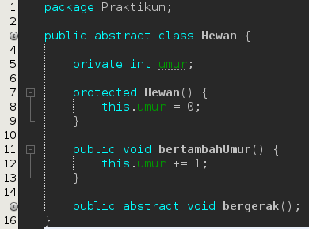
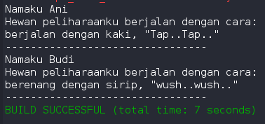
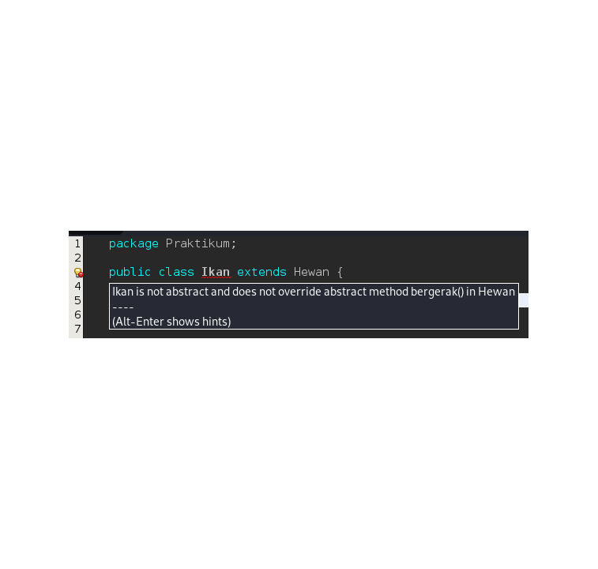
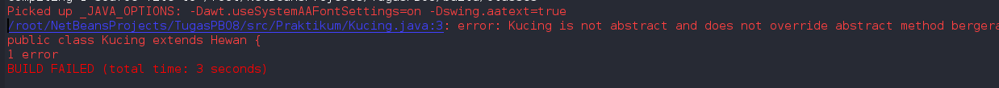
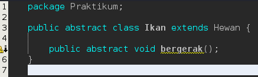
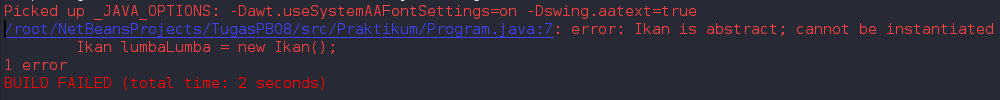

# Laporan

untuk praktikum bisa langsung di cek pada folder yang sudah disertakan di sini saya akan langsung menuju ke pertanyaan.

## Pertanyaan

1. Berikan penjelasan terkait tentang jalannya program diatas

jawab : program di atas class orang akan memberi inputan ke class hewan, kemudian dari class hewan akan di arahkan ke class yang di panggil dan akan memprint method abstract yang sudah di overriding

2. Tunjukkan hasil kompilasi program dan berikan penjelasan singkat jika method
bergerak() diubah menjadi method abstract!

jawab : Hasil nya tidak terjadi error dan akan sama seperti praktikum

3. Tunjukkan hasil kompilasi program dan berikan penjelasan singkat jika tidak dilakukan
overriding terhadap method bergerak()

jawab : hasil nya akan terjadi error karena tidak ada rujukan untuk abstrack nya

4. Tunjukkan hasil kompilasi program dan berikan penjelasan singkat jika abstract method
bergerak()yang dideklarasikan dalam Class Ikan

jawab : hasilnya akan terjadi error, program akan menanyakan lumba lumba untuk class ikan

