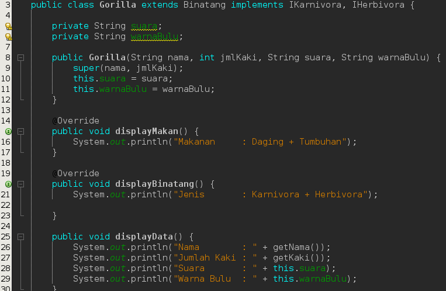
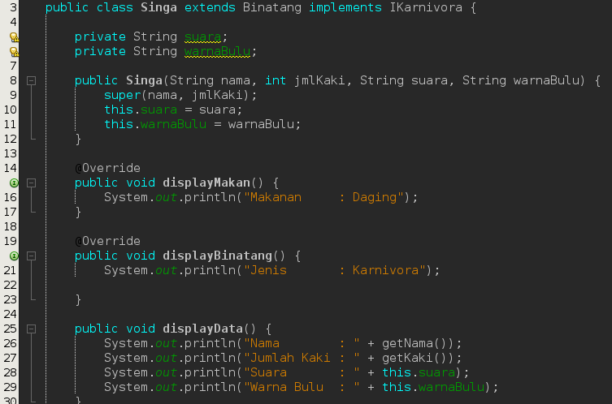

# Laporan

di sini saya akan langsung menuju ke pertanyaan untuk praktikum bisa langsung melihat di file yang sudah tertera

## Pertanyaan 1

1) Pada langkah ke 9, pada baris program ke 3 terdapat warning pada script tersebut. Jelaskan penyebab terjadinya hal tersebut ?

jawab : karena icumlaude berada pada satu package, karena satu package maka tidak perlu menggunakan import sudah bisa memakai class tersebut.

2) Pada langkah ke 9, pada baris program ke 3. Apa yang terjadi jika script tersebut dihilangkan? Jelaskan menurut pemahaman anda.

jawab : tidak akan terjadi error karena icumlaude berada pada satu package maka tidak perlu lagi untuk mengimport icumlaude yang berada pada satu package.

3) Mengapa pada langkah nomor 9 terjadi error? Jelaskan!

jawab : karena class Mahasiswa bukan merupakan implementasi dari ICumlaude.

4) Dapatkah method kuliahDiKampus() dipanggil dari objek sarjanaCumlaude di class Program? Mengapa demikian?

jawab : tidak bisa karena class mahasiswa bukan implementasi dari ICumlaude dan juga pada praktikum tidak ada class dengan nama Program.

5) Dapatkah method kuliahDiKampus() dipanggil dari parameter mahasiswa di method beriSertifikatCumlaude() pada class Rektor? Mengapa demikian?

jawab : tidak bisa karena class mahasiswa bukan implementasi dari ICumlaude di mana pada class rektor terhubung dengan ICumlude.

6) Modifikasilah method beriSertifikatCumlaude() pada class Rektor agar hasil eksekusi class Program menjadi seperti berikut ini:

jawab : 

## Pertanyaan 2 :

1) Pada script code interface IBerprestasi, modifikasi script tersebut sesuai dengan gambar dibawah ini :

jawab : 

tidak bisa dan terjadi error karena yang namanya abstract perlu untuk di turunkan atau diakses oleh child class.

2) Jelaskan menurut anda, mengapa hasil dari script code tersebut error ?

jawab : karena pada dasarnya abstract method harus di overriding pada class yang mengimplementasikan interfaces class.

3) Apabila Sarjana Berprestasi harus menjuarai kompetisi NASIONAL dan menerbitkan artikel di jurnal NASIONAL, maka modifikasilah class-class yang terkait pada aplikasi Anda agar di class Program objek pakRektor dapat memberikan sertifikat mawapres pada objek sarjanaCumlaude

jawab : 

## Tugas

## Diagram

Sekian laporan saya kurang lebih nya mohon maaf.