# Laporan

## Pertayaan 4.2

1) Class apa sajakah yang merupakan turunan dari class Employee?

jawab : intershipemployee dan permanentemployee

2) Class apa sajakah yang implements ke interface Payable?

jawab : electricitybill dan permanentemployee

3) Perhatikan class Tester1, baris ke-10 dan 11. Mengapa e, bisa diisi
dengan objek pEmp (merupakan objek dari class PermanentEmployee)
dan objek iEmp (merupakan objek dari class
InternshipEmploye) ?

jawab : karena class intershipemployee dan permanentemployee merupakan turunan dari class employee

4) Perhatikan class Tester1, baris ke-12 dan 13. Mengapa p, bisa diisi
denganobjekpEmp
(merupakan
objek
dari
class
PermanentEmployee) dan objek eBill (merupakan objek dari class
ElectricityBill) ?

jawab : karena class PermanentEmployee dan ElectricityBill merupakan implementasi dari interface IPayable

5) Coba tambahkan sintaks:
p = iEmp;
e = eBill;
pada baris 14 dan 15 (baris terakhir dalam method main) ! Apa yang
menyebabkan error?

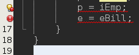

jawab : karena class intershipemployee bukan implementasi dari interface IPayable dan class ElectricityBill bukan turunan dari class employee

6) Ambil kesimpulan tentang konsep/bentuk dasar polimorfisme!

jawab : kesimpulannya konsep/bentuk dasar polimorfisme mempermudah dalam pembuatan coding karena bisa memperdikit baris program

## Pertanyaan 5.2

1) Perhatikan class Tester2 di atas, mengapa pemanggilan
e.getEmployeeInfo()
pada
baris
8
dan
pEmp.getEmployeeInfo() pada baris 10 menghasilkan hasil sama?

jawab : karena ada codingan e = pEmp yang menandakan bahwa e akan di isi sama dengan pEmp maka hasil output pun sama.

2) Mengapa pemanggilan method e.getEmployeeInfo() disebut sebagai
pemanggilan method virtual (virtual method invication), sedangkan
pEmp.getEmployeeInfo() tidak?

jawab : karena e memanggil overriding di class turunannya yaitu pEmp sedangkan pEmp langsung mengaksesnya karena memeang method tersebut ada di class itu.

3) Jadi apakah yang dimaksud dari virtual method invocation? Mengapa
disebut virtual?

jawab : di sbut virtual karena seperti yang saya jelaskan di soal sebelumnya parent class memanggil overriding dari sub class.

## Pertanyaan 6.2

1) Perhatikan array e pada baris ke-8, mengapa ia bisa diisi dengan objek-
objek dengan tipe yang berbeda, yaitu objek pEmp (objek dari
PermanentEmployee) dan objek iEmp (objek dari
InternshipEmployee) ?

jawab : karena class intershipemployee dan permanentemployee merupakan turunan dari class employee

2) Perhatikan juga baris ke-9, mengapa array p juga biisi dengan objek-objek
dengan tipe yang berbeda, yaitu objek pEmp (objek dari
PermanentEmployee) dan objek eBill (objek dari
ElectricityBilling) ?

jawab : karena class PermanentEmployee dan ElectricityBill merupakan implementasi dari interface IPayable

3) Perhatikan baris ke-10, mengapa terjadi error?

jawab : karena class intershipemployee bukan implementasi dari interface IPayable dan class ElectricityBill bukan turunan dari class employee

## Pertanyaan 7.2

1) Perhatikan class Tester4 baris ke-7 dan baris ke-11, mengapa
pemanggilan ow.pay(eBill) dan ow.pay(pEmp) bisa dilakukan,
padahal jika diperhatikan method pay() yang ada di dalam class Owner
memiliki argument/parameter
bertipe
Payable?Jika diperhatikan
lebih detil
ElectricityBill dan
eBill
merupakan objek dari
pEmp merupakan objek dari
PermanentEmployee?

jawab : itu semua bisa terjadi karena class PermanentEmployee dan ElectricityBill merupakan implementasi dari interface IPayable

2) Jadi apakah tujuan membuat argument bertipe Payable pada method
pay() yang ada di dalam class Owner?

jawab : agar class yang menggunakan interface dari payable bisa diberikan nilai.

3) Coba pada baris terakhir method main() yang ada di dalam class
Tester4 ditambahkan perintah ow.pay(iEmp);

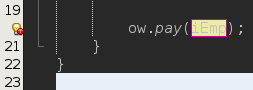

Mengapa terjadi error?

jawab : karena class intershipemployee bukan implementasi dari interface IPayable

4) Perhatikan class Owner, diperlukan untuk apakah sintaks p
instanceof ElectricityBill pada baris ke-6 ?

jawab : p digunakan untuk mengecek apakah suatu objek merupakan hasil instansiasi class ElectricityBill atau tidak

5) Perhatikan kembali class Owner baris ke-7, untuk apakah casting objek
disana
(ElectricityBill
eb
=
(ElectricityBill)
p)
diperlukan ? Mengapa objek p yang bertipe Payable harus di-casting ke
dalam objek eb yang bertipe ElectricityBill ?

jawab : digunakan untuk mengubah tipe dari suatu objek eb class electricitybill ke p ipaybel

## Tugas

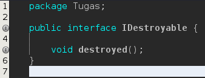

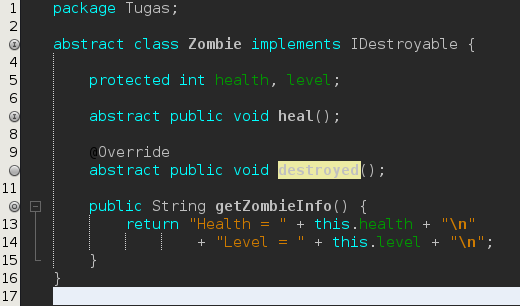

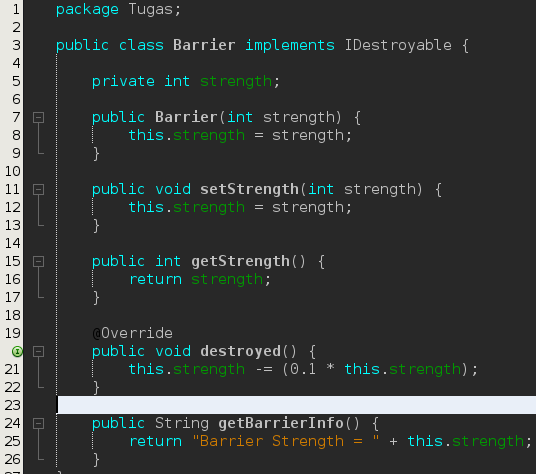

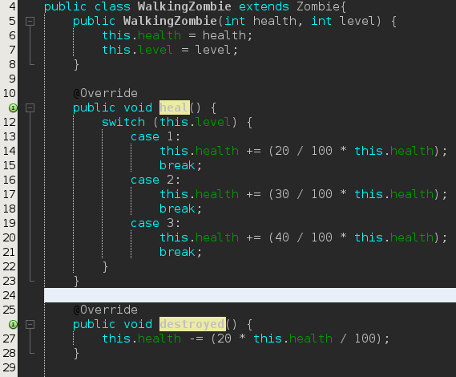

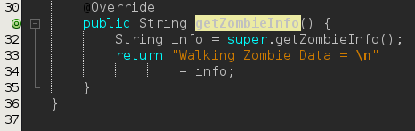

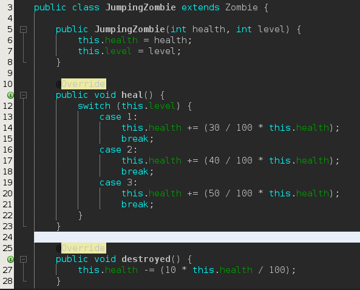

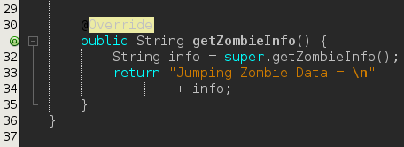

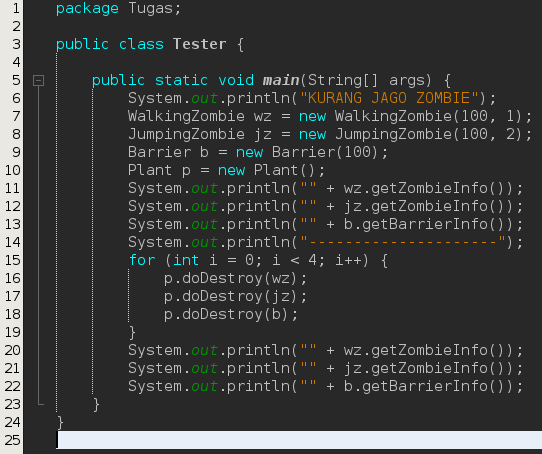

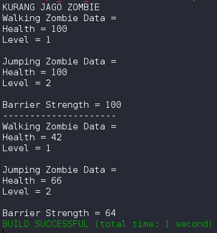