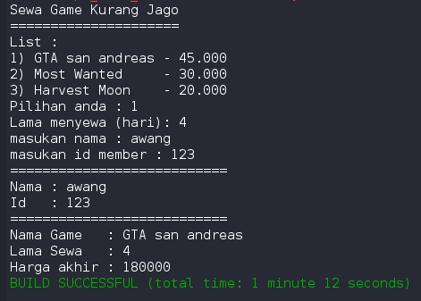
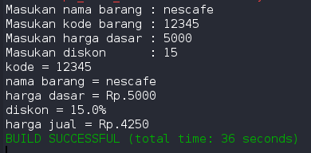

# Laporan Pertemuan 2 PBO
pada pertemuan lalu saya diberi tugas seperti di bawah :

## Tugas
1. Suatu toko persewaan video game salah satu yang diolah adalah peminjaman, dimana
data yang dicatat ketika ada orang yang melakukan peminjaman adalah id, nama
member, nama game, dan harga yang harus dibayar. Setiap peminjaman bisa
menampilkan data hasil peminjaman dan harga yang harus dibayar. Buatlah class
diagram pada studi kasus diatas!
Penjelasan:
- Harga yang harus dibayar diperoleh dari lama sewa x harga.
- Diasumsikan 1x transaksi peminjaman game yang dipinjam hanya 1 game saja.
2. Buatlah program dari class diagram yang sudah anda buat di no 1!
3. Buatlah program sesuai dengan class diagram berikut ini:

4. Buatlah program sesuai dengan class diagram berikut ini:

Deskripsi / Penjelasan :
- Nilai atribut hargaDasar dalam Rupiah dan atribut diskon dalam %
- Method hitungHargaJual() digunakan untuk menghitung harga jual dengan
perhitungan berikut ini:
<strong>harga jual = harga dasar – (diskon x harga dasar)</strong>
- Method tampilData() digunakan untuk menampilkan nilai dari kode, namaBarang,
hargaDasar, diskon dan harga jual.

## Jawab :
1) untuk diagram class nya menurut saya seperti di bawah:

2) nomor 2 adalah implementasi dari diagram class diatas, untuk implementasi dari saya kurang lebih seperti di bawah :

3) pada soal nomor 3 saya di suruh mrmbuat implementasi dari diagram class yang sudah disediakan dimana dalam diagram class tersebut ada phi, r, hitung luas, dan hitung keliling, untuk implementasi dari saya kurang lebih seperti dibawah :

4) untuk nomor 4 sama seperti nomor 3 namun beda nya ada point point khusus yang harus di masukkan pada impementasi nya, implementasinya kurang lebih seperti di bawah :

## note:
saya berusaha mengimplementasi kan nya kedalam pemrograman berbasis object dan hasilnya seperti diatas.

mohon maaf sebesar besar nya jika terdapat kesalahan pada laporan diatas.

sekian dari saya awang syukriansah dirgantoro TI-2C