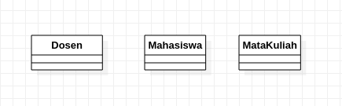
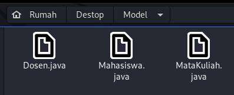
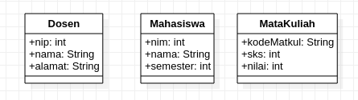
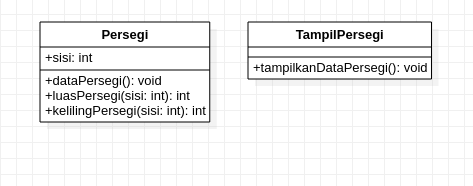

# Laporan PBO Teori

## Latihan 1 :
### soal :
Jurusan Teknologi Informasi akan membangun system
informasi pemberian nilai secara online kepada setiap
mahasiswa yang menempuh perkuliahan. Setiap nilai mata
kuliah yang akan dimasukkan dalam system di inputkan
secara langsung oleh dosen yang bersangkutan. Dari
system ini diharapkan mahasiswa akan lebih mudah untuk
melakukan evaluasi terhadap setiap matakuliah yang
sudah pernah diikuti.
1) Identifikasi, ada berapa class yang bisa dibuat dari
sistem diatas ?
2) Implementasikan class dalam bahasa pemrograman java
dan class diagram!

### Jawab :
1) untuk point 1 yang bisa saya identifikasi ada 3 class yaitu class Dosen, class Mahasiswa, dan class MataKuliah.

2) untuk point 2 hanya tinggal menggenerate nya kedalam bentuk file java dengan cara klik tool > java > generate. berikut adalah hasil generate saya.

## Latihan 2 :
### soal:
Tambahkan secara lengkap attribute pada setiap class
yang sudah anda identifikasi pada latihan sebelumnya
(Latihan 1)?
### jawab:
nah disini menurut saya pada class Dosen memiliki atribut nip, nama, dan alamat. kemudian untuk class Mahasiswa memiliki atribut nim, nama, dan semester. dan untuk class MataKuliah memiliki atribut kode mata kuliah, sks, dan nilai.

## Latihan 3 :
### soal:
Buatlah implementasi dengan menggunakan class diagram dari soal berikut
:
1) Class Persegi dengan atribut sisi dengan tipe data integer.
2) Terdapat tiga method :
- Method data persegi untuk menampilkan data panjang sisi dari persegi
tersebut.
- Method luas persegi untuk menghitung luas dari persegi tersebut dengan
rumus : sisi x sisi.
- Method keliling persegi untuk menghitung keliling dengan rumus : 4 x sisi.
3) Tampilkan data persegi, nilai luas persegi dan keliling persegi pada class
TampilPersegi.
### jawab:
berikut hasil dari pekerjaan saya untuk latihan 3.
