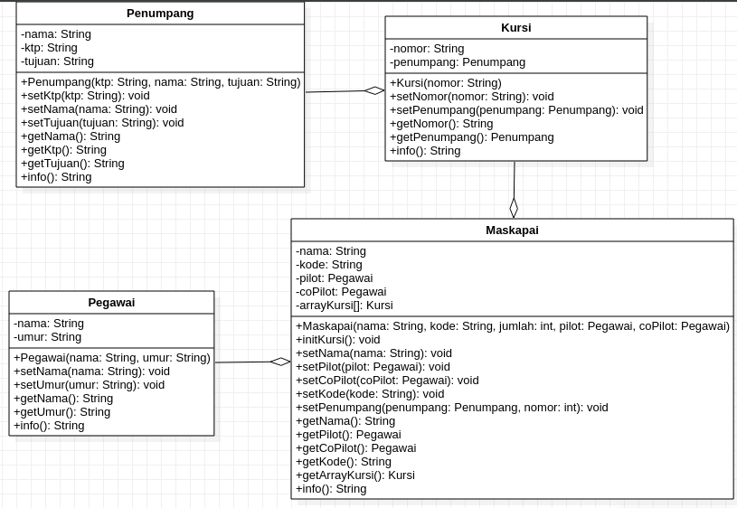
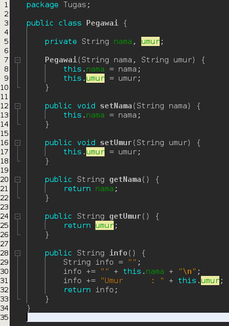
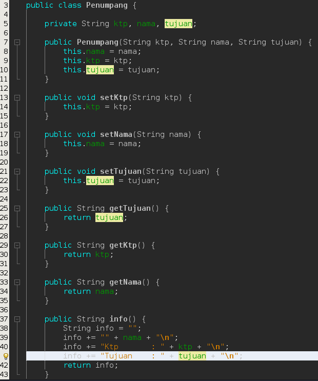
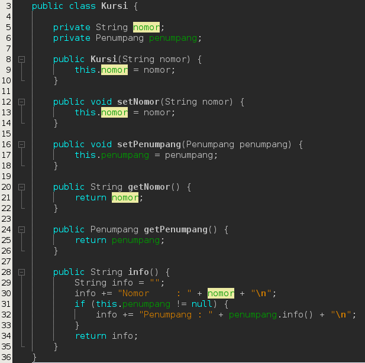
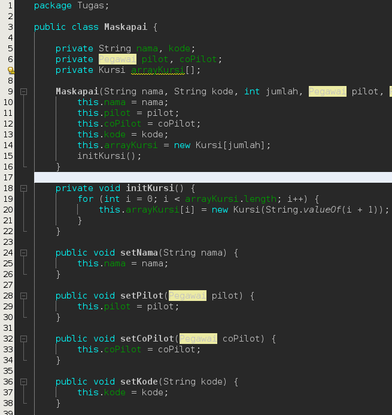
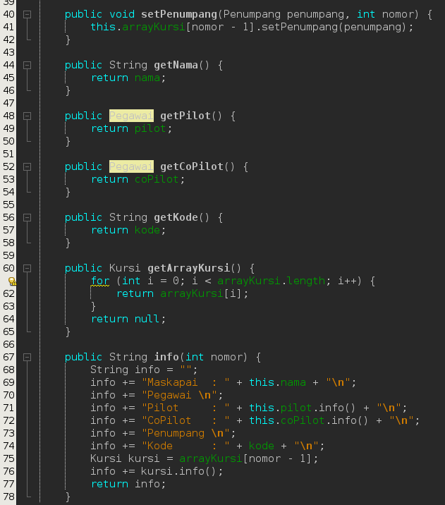
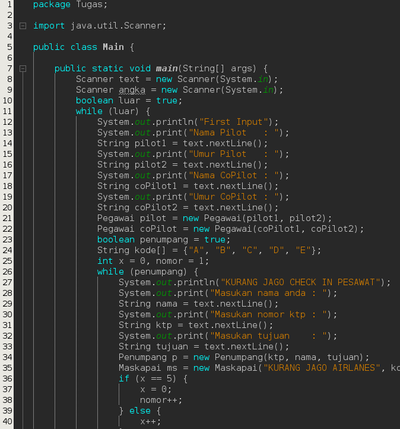
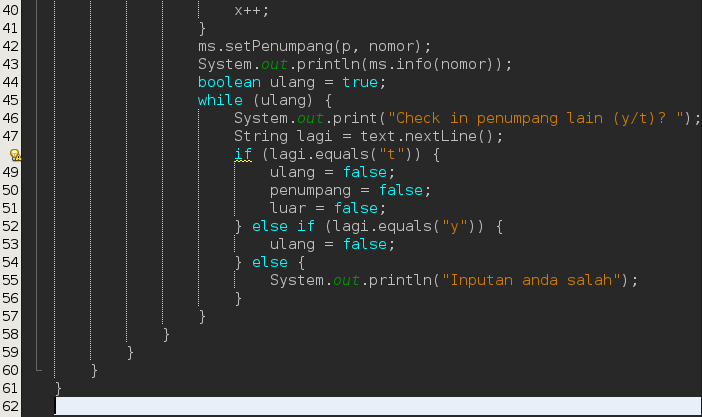
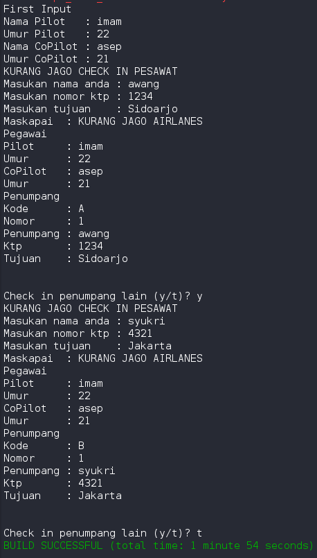

# Laporan

## Tugas :

Buatlah sebuah studi kasus, rancang dengan class diagram, kemudian implementasikan ke dalam
program! Studi kasus harus mewakili relasi class dari percobaan‐percobaan yang telah dilakukan
pada materi ini, setidaknya melibatkan minimal 4 class (class yang berisi main tidak dihitung).

## Jawab

saya mengambil studi kasus proses cek in pada saat menaiki pesawat, dan berikut class diagram yang saya buat :

di situ terdapat 4 class yaitu Pegawai, Penumpang, Kursi, dan Maskapai. Setiap class memiliki relasi nya masing masing dan pusat dari relasi nya yaitu class Maskapai.

Codingan pada setiap class juga berbeda, codingan saya untuk setiap class kurang lebih seperti berikut.

class Pegawai :

class Penumpang :

class Kursi :

class Maskapai : 

Untuk class main kurang lebih seperti berikut

Output nya akan seperti berikut

### jadi sistem nya pada program saya yaitu seat 1 akan ada 5 kode yaitu A,B,C,D,E. jika sudah terisi seat 1 maka akan lanjut ke seat 2 dan begitu seterusnya.

### alur program nya pertama kita akan melakukan first input yaitu memasukan nama serta umur pilot dan co pilot nya. kemudian setelah itu akan diarahkan untuk mengisi data diri serta tujuan penerbangan. untuk seat akan secara otomatis. setelah inputan lengkap maka akan di print keseluruhan atau bisa di sebut struk atau boarding pass.

### sekian penjelasan tentang program saya kurang lebih nya mohon maaf