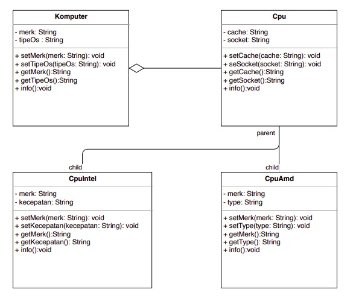

# Laporan Hasil Diskusi

## Kelompok Komputer

Dari hasil diskusi kita menyimpulkan dan mendapat diagram seperti berikut : 

Dari gambar diatas bisa di lihat kami mengambil class cpu sebagai aggregate dari class komputer karena menurut kami di dalam komputer tersebut terdapat cpu. kemudian cpu akan menjadi parent dari turunan nya yaitu class CpuIntel dan CpuAmd masing memiliki keunikan masing masing oleh karena itu kita menjadikan nya sebagai class turunan dari cpu.