# Laporan Praktikum

untuk praktikum bisa langsung di cek pada folder yang sudah ada pada laporn ini saya langsung menuju ke pertanyaan

## Pertanyaan 1

1) Pada percobaan 1 diatas program yang dijalankan terjadi error, kemudian perbaiki sehingga program tersebut bisa dijalankan dan tidak error!

jawab : cara mengatasinya yaitu dengan menambahkan seperti berikut 

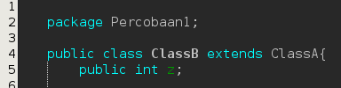

kemudian ketika dijalan kan maka akan tidak terjadi error lagi dan hasilnya seperti berikut

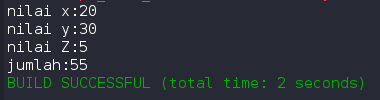

2) Jelaskan apa penyebab program pada percobaan 1 ketika dijalankan terdapat error!

jawab : error yang terjadi di karenakan tidak ada nya relasi ke class A

## Pertanyaan 2

1) Pada percobaan 2 diatas program yang dijalankan terjadi error, kemudian perbaiki sehingga program tersebut bisa dijalankan dan tidak error!

jawab : cara mengatasinya yaitu dengan menambahkan seperti berikut

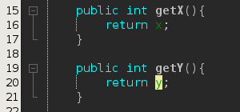

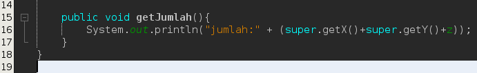

kemudian hasilnya akan bisa muncul seperti berikut

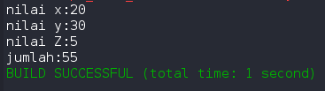

2) Jelaskan apa penyebab program pada percobaan 1 ketika dijalankan terdapat error!

jawab :  sumber dari error tersebut yaitu kurang nya getter untuk mengambil nilai x dan y

## Pertanyaan 3 

1) Jelaskan fungsi “super” pada potongan program berikut di class Tabung!

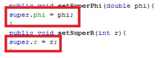

jawab : fungsi super pada codingan tersebut adalah untuk mengambil variabel pada class Bangun

2) Jelaskan fungsi “super” dan “this” pada potongan program berikut di class Tabung!

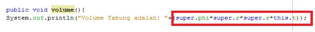

jawab : seperti penjelasan pada nomor 1 fungsi super adalah untuk mengambil variabel dari class Bangun sedangkan this adalah untuk mendefinisikan mengambil variabel dari class itu sendiri.

3) Jelaskan mengapa pada class Tabung tidak dideklarasikan atribut “phi” dan “r” tetapi class tersebut dapat mengakses atribut tersebut!

jawab : mengapa bisa diakses? alasannya karena class Tabung adalah turunan dari class Bangun

## Pertanyaan 4

1) Pada percobaan 4 sebutkan mana class yang termasuk superclass dan subclass, kemudian jelaskan alasannya!

jawab : superclass nya yaitu class A sedangkan subclass nya yaitu class B dan C karena ada extends yang merujuk ke class lainnya. untuk class B juga termasuk superclass untuk class C karena class C extends nya merujuk ke class B.

2) Ubahlah isi konstruktor default ClassC seperti berikut:

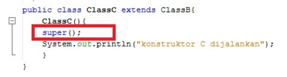

Tambahkan kata super() di baris Pertaman dalam konstruktor defaultnya. Coba jalankan
kembali class Percobaan4 dan terlihat tidak ada perbedaan dari hasil outputnya!

jawab : 

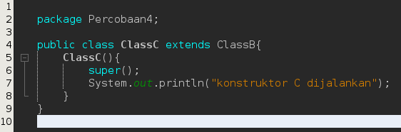

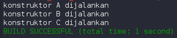

3) Ublah isi konstruktor default ClassC seperti berikut:

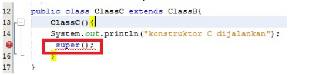

Ketika mengubah posisi super() dibaris kedua dalam kontruktor defaultnya dan terlihat ada
error. Kemudian kembalikan super() kebaris pertama seperti sebelumnya, maka errornya
akan hilang.
Perhatikan hasil keluaran ketika class Percobaan4 dijalankan. Kenapa bisa tampil output
seperti berikut pada saat instansiasi objek test dari class Class

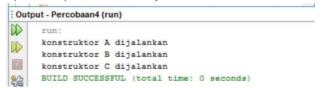

Jelaskan bagaimana urutan proses jalannya konstruktor saat objek test dibuat!

jawab :  seperti layaknya program cara membacaprogram adalah dari baris teratas kemudian dilanjut ke baris selanjutnya sampai habis. tapi mengapa ada warnig disitu? itu karena secara logika jika merupakan turunan maka tidak bisa di eksekusi terebih dahulu dibanding dengan class parent nya.

4) Apakah fungsi super() pada potongan program dibawah ini di ClassC!

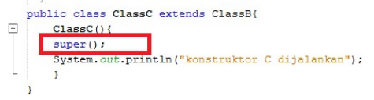

jawab : fungsi nya adalah untuk mengeksekusi parent nya terlebih dahulu yaitu class B.

## Tugas

class Pegawai

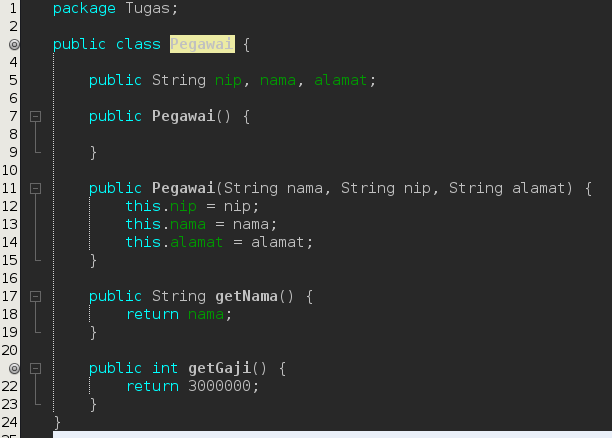

class Dosen

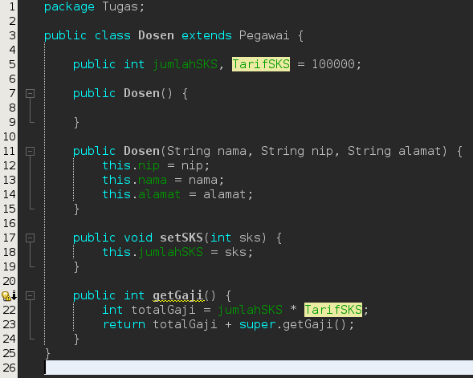

class DaftarGaji

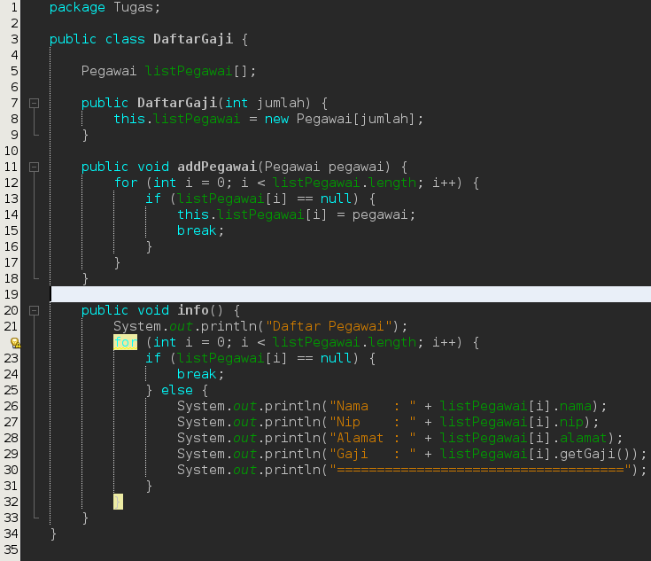

class Main

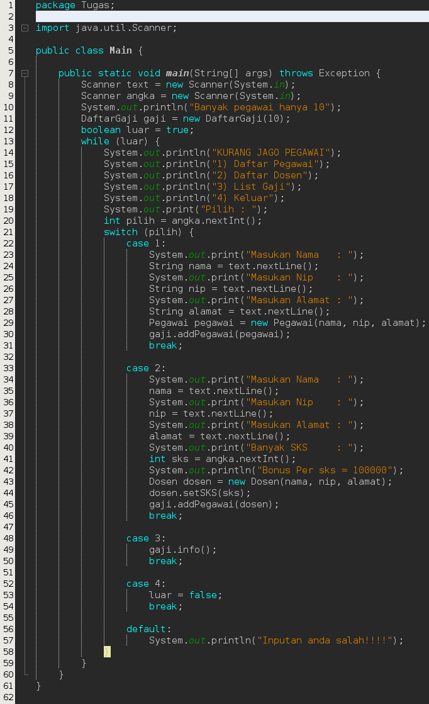

Hasil

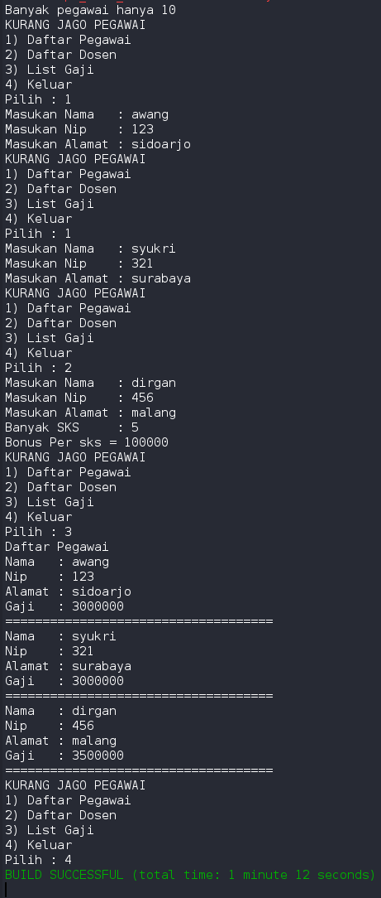

untuk tugas pengerjaan saya seperti itu saya mendapat logika seperti itu, saya menset gaji bersih 3jt dan tambahan untuk dosen per sks mendapat tambahan 100rb.

sekian laporan saya kurang lebihnya mohon maaf.