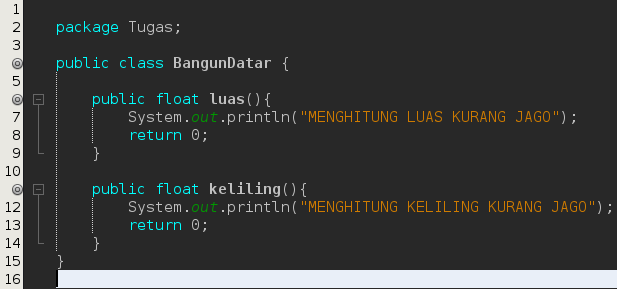
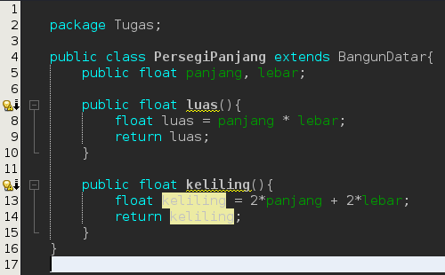
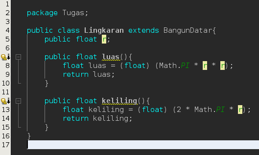
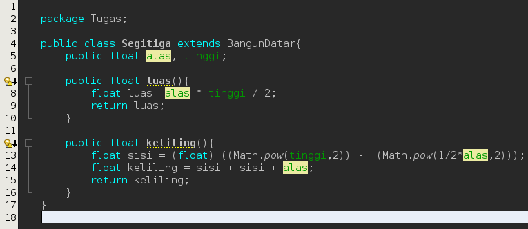
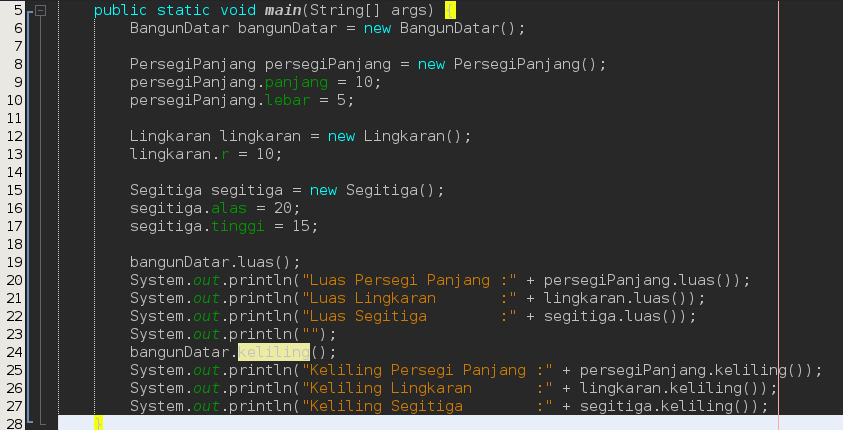
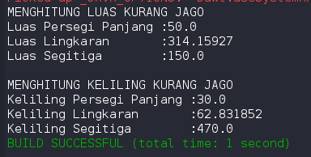

# Laporan 
pada tugas di suruh membuat program dari diagram class yang sudah ada berikut implementasiny menurut saya

## Class BangunDatar

## Class PersegiPanjang

## Class Lingkaran

## Class Segitiga

## Class Main

## Hasil

