# Laporan

untuk praktikum bisa langsung di cek pada folder yang sudah saya sertakan

Saya di sini akan langsung menuju ke pertanyaan pertanyaan yang ada di job sheet

## Pertanyaan 1 :

1. Sebutkan class mana yang termasuk super class dan sub class dari percobaan 1 diatas!

jawab : super class nya yaitu class karyawan dan sub class nya yaitu class manager dan class staff

2. Kata kunci apakah yang digunakan untuk menurunkan suatu class ke class yang lain?

jawab : kata kunci nya yaitu extends yang artinya meluas dimana class tersebut bisa di luaskan atau di turunkan ke class lainya

3. Perhatikan kode program pada class Manager, atribut apa saja yang dimiliki oleh class
tersebut? Sebutkan atribut mana saja yang diwarisi dari class Karyawan!

jawab : semua atribut yang ada pada class manager semuanya mewarisi dari class karyawan dengan tambahan 1 atribut yaitu tunjangan

4. Jelaskan kata kunci super pada potongan program dibawah ini yang terdapat pada class
Manager!

jawab : super pada potongan tersebut artinya mengambil informasi dari class yang menurunkan atribut gaji.

5. Program pada percobaan 1 diatas termasuk dalam jenis inheritance apa? Jelaskan
alasannya!

jawab : menurut saya termasuk dalam inheritance hirarki karena 1 class meluas ke 2 class lainya sejajar di bawah class tersebut.

## Pertanyaan 2 :

1. Berdasarkan class diatas manakah yang termasuk single inheritance
dan mana yang termasuk multilevel inheritance?

jawab : single inheritance yaitu class manager sedangkan multilevel inheriance adalah class staffTetap dan staffHarian

2. Perhatikan kode program class StaffTetap dan StaffHarian, atribut apa saja yang
dimiliki oleh class tersebut? Sebutkan atribut mana saja yang diwarisi dari class
Staff!

jawab : yang diwarisi oleh staf adalah nama,alamat,jk,umur,gaji,lembur,dan potongan sedangkan untuk atribut staffTetap sendiri mempunyai atribut golongan dan asuransi sedangkan staffharian mempunyai atribut jmlJamKerja.

3. Apakah fungsi potongan program berikut pada class StaffHarian

jawab : fungsi nya yaitu untuk menginputkan data melalui konstruktor pada class Staff

4. Apakah fungsi potongan program berikut pada class StaffHarian

jawab : untuk memanggil fungsi tampilDataStaff pada class Staff.

5. Perhatikan kode program dibawah ini yang terdapat pada class StaffTetap. Terlihat dipotongan program diatas atribut gaji, lembur dan potongan dapat diakses
langsung. Kenapa hal ini bisa terjadi dan bagaimana class StaffTetap memiliki atribut gaji,
lembur, dan potongan padahal dalam class tersebut tidak dideklarasikan atribut gaji, lembur,
dan potongan?

jawab : itu karena atribut tersebut bertipe public.

## Tugas :

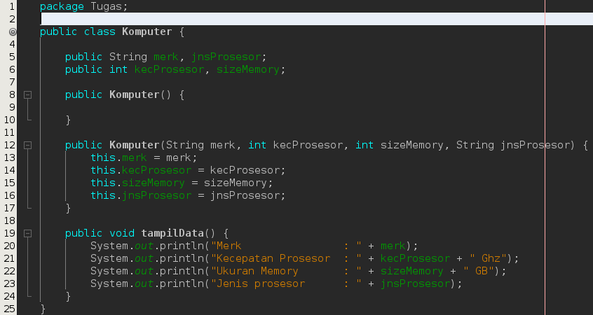

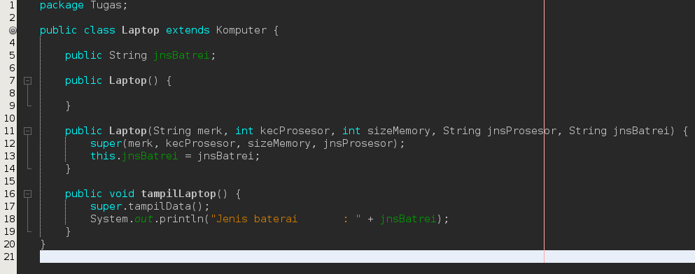

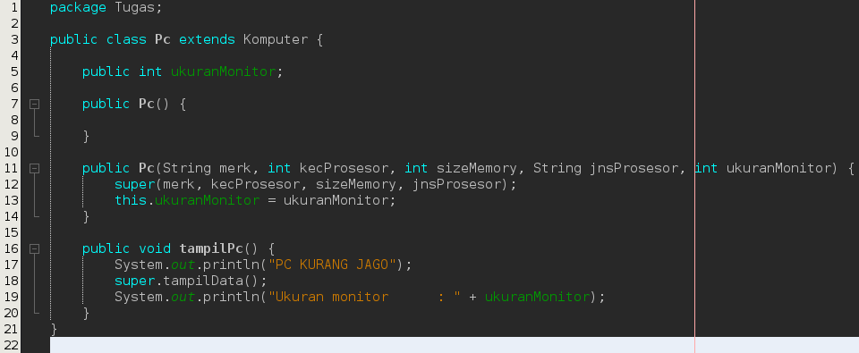

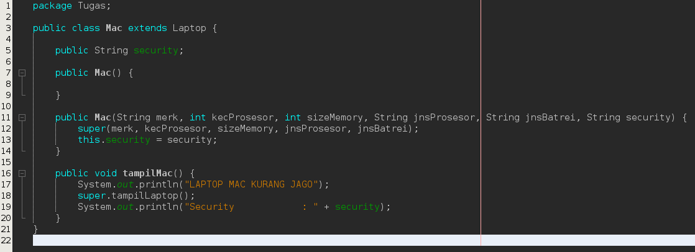

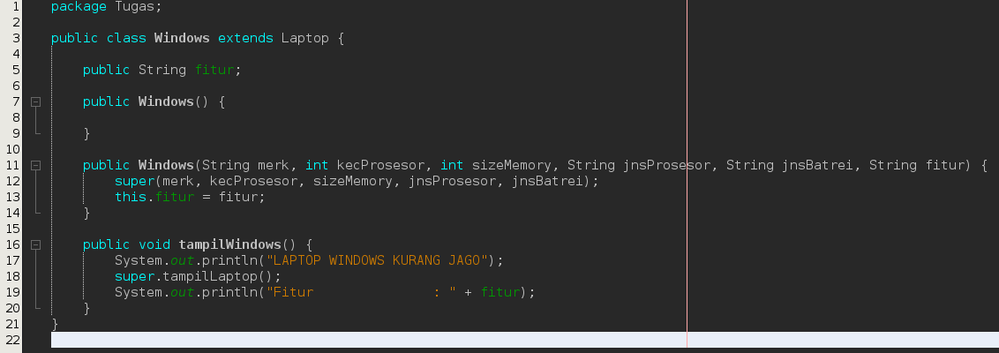

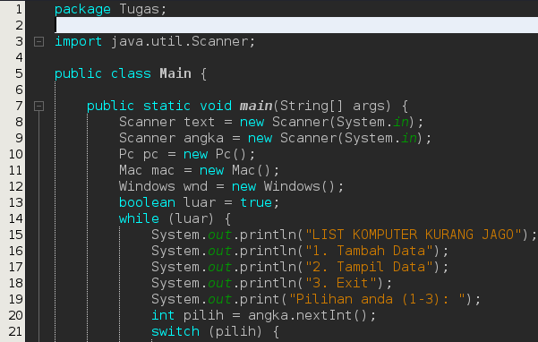

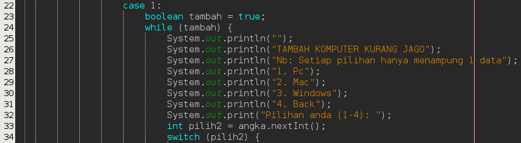

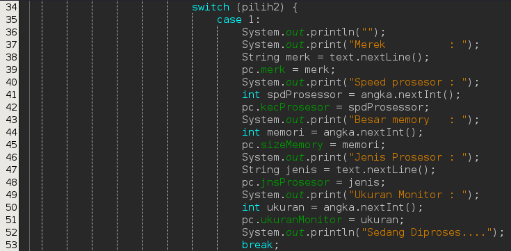

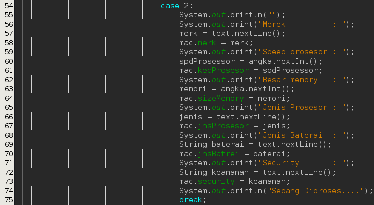

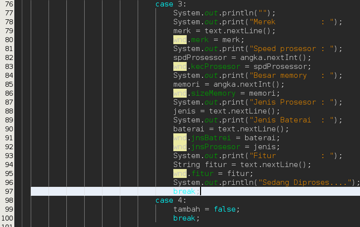

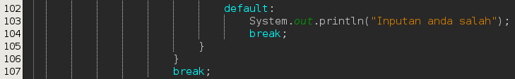

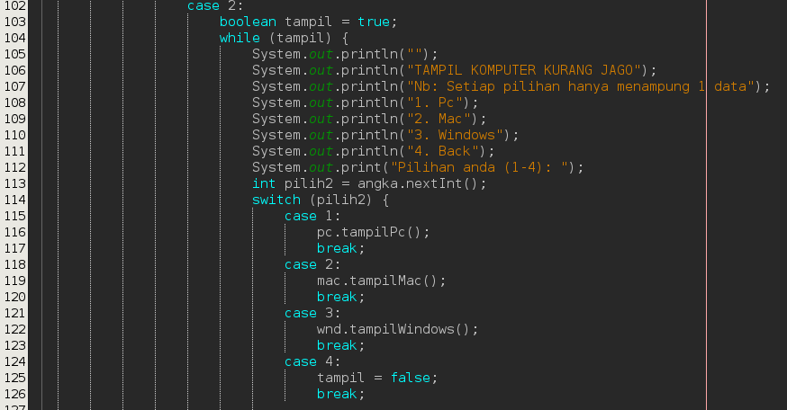

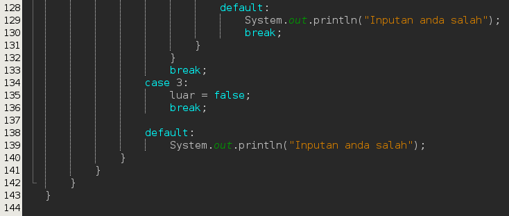

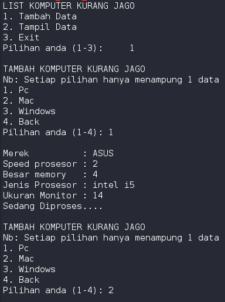

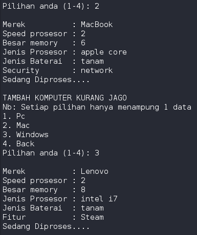

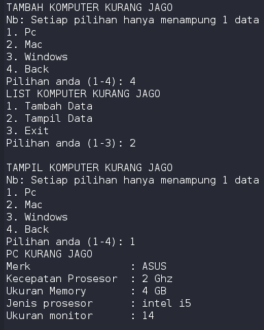

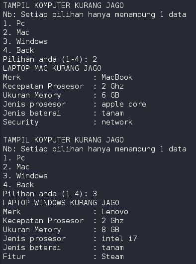

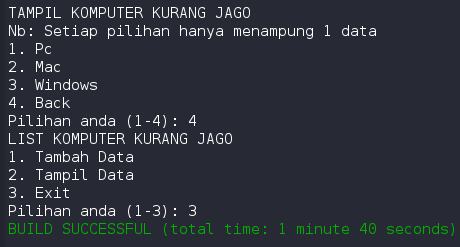

pada program diatas menurut saya menggunakan hybrid inheritence, dan bisa di lihat pada source code diatas codingan saya. sekian laporan saya mohon maaf jika ada kurang. terima kasih