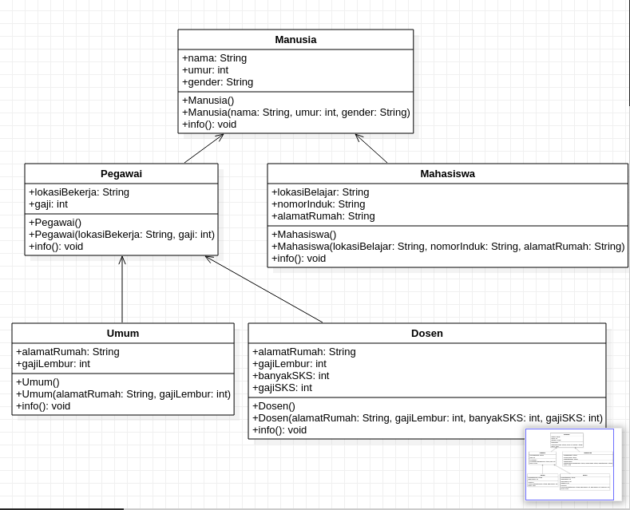

# Laporan Pengerjaan

saya mengambil contoh kasus untuk mendata seluruh manusia yang berada pada sebuah lingkungan kampus. Dimana di situ akan ada manusia sebagai superclass nya dan ada subclass subclass yang mengacu pada superclass tersebut. Berikut kurang lebih UML yang sudah saya buat.

di situ terdapat berbagai class seperti pegawai mahasiswa dosen dan umum yang pada dasar nya mengacu ke class manusia.

sekian laporan saya bila ada kekurangan mohon di maafkan