# Laporan

untuk praktikum bisa langsung dilihat di file yang sudah disertakan di sini saya langsung menuju ke pertanyaan

## Pertanyaan 1

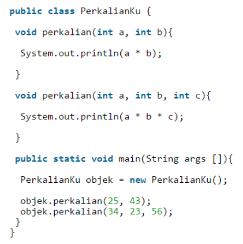

4.1 Dari source coding diatas terletak dimanakah overloading?

jawab : 

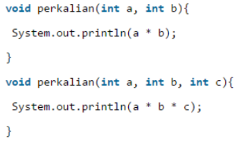

4.2 Jika terdapat overloading ada berapa jumlah parameter yang berbeda?

jawab : jumlah parameter yang berbeda adalah 1 yaitu int c

## Pertanyaan 2

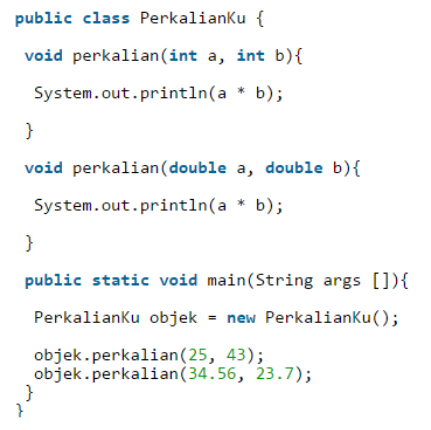

4.3 Dari source coding diatas terletak dimanakah overloading?

jawab : 

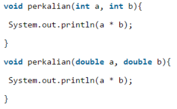

4.4 Jika terdapat overloading ada berapa tipe parameter yang berbeda?

jawab : terdapat 2 tipe parameter yaitu adalah int dan double

## Pertanyaan 3

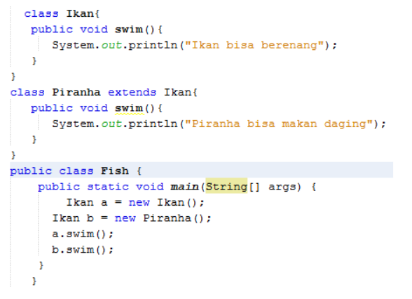

4.5 Dari source coding diatas terletak dimanakah overriding?

jawab : 

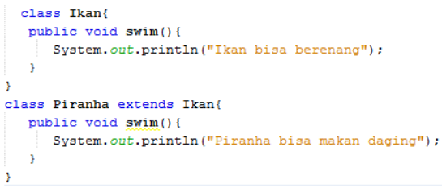

4.6 Jabarkanlah apabila sourcoding diatas jika terdapat overriding?

jawab : diatas terdapat overriding yaitu swim dimana terdapat method swim pada superclass dan subclass nya.

## Tugas

1) 

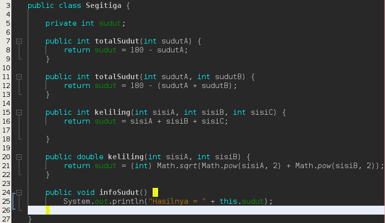

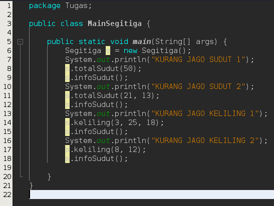

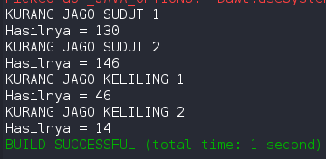

2) 

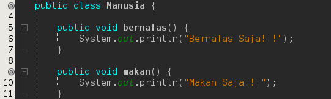

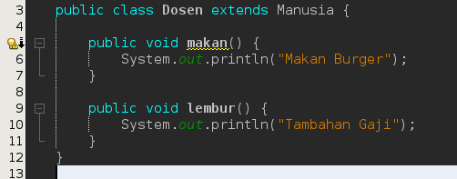

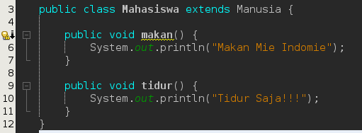

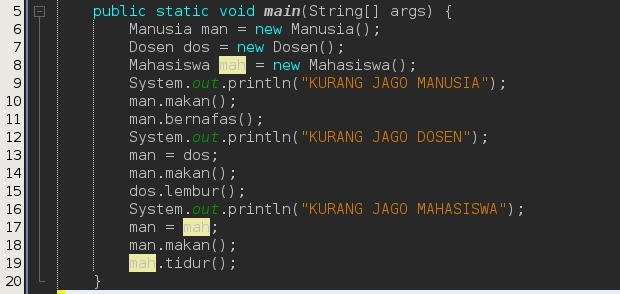

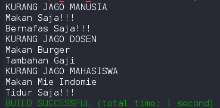

sekian dari saya jika ada kekurangan mohon maaf.